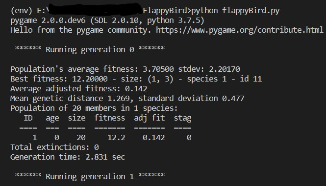

# **NEAT Flappy Bird AI**

Flappy Bird played with AI using the [NEAT](https://neat-python.readthedocs.io/en/latest/neat_overview.html) Python module and the [pygame](https://www.pygame.org/docs/) module for the application interface.

## Instructions

1. Install the dependencies `pip install -r requirements.txt` .

2. Then run the python file `python flappyBird.py` .

3. The AI will start training itself and you can see the progress in the console.

Running Application

Consider giving a start if it helped you ⭐ ✌
